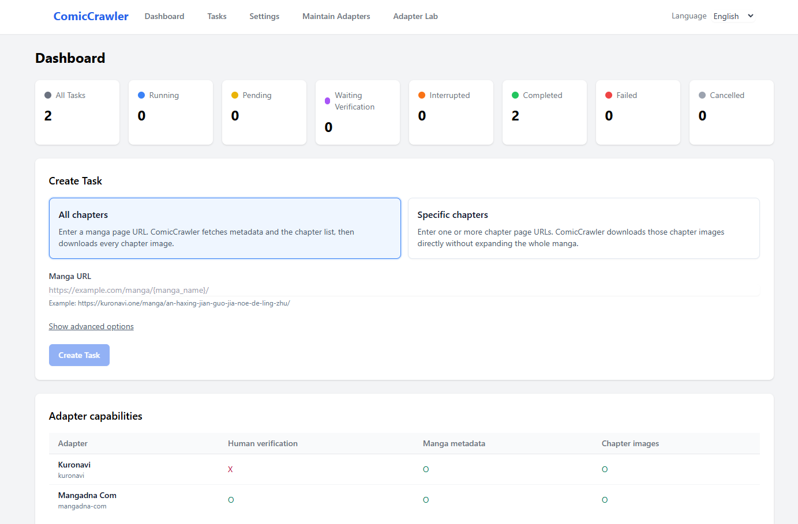
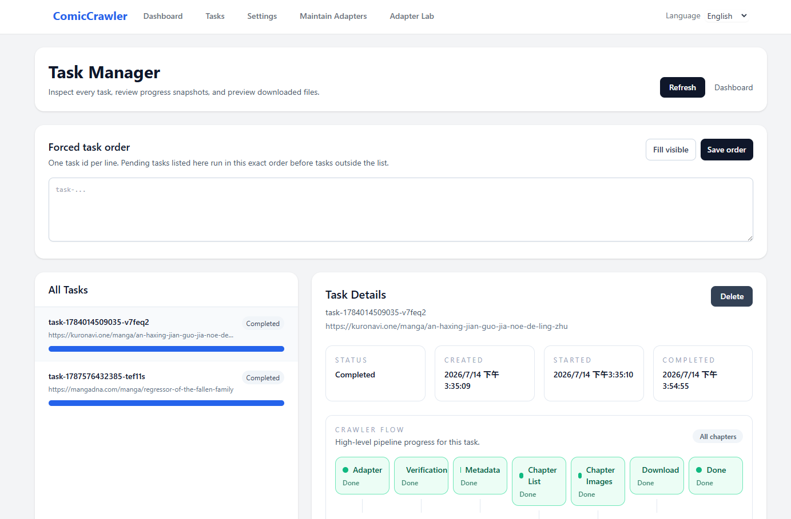
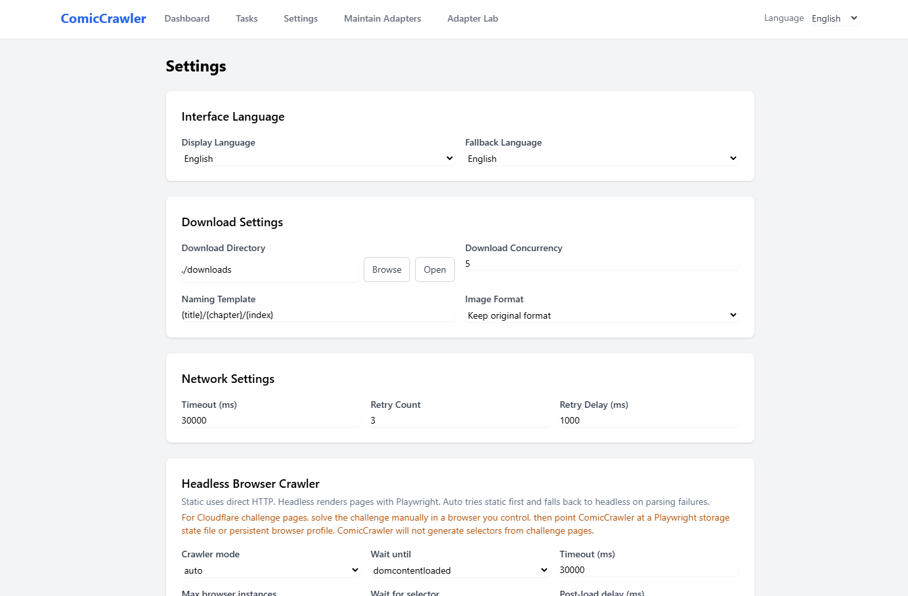
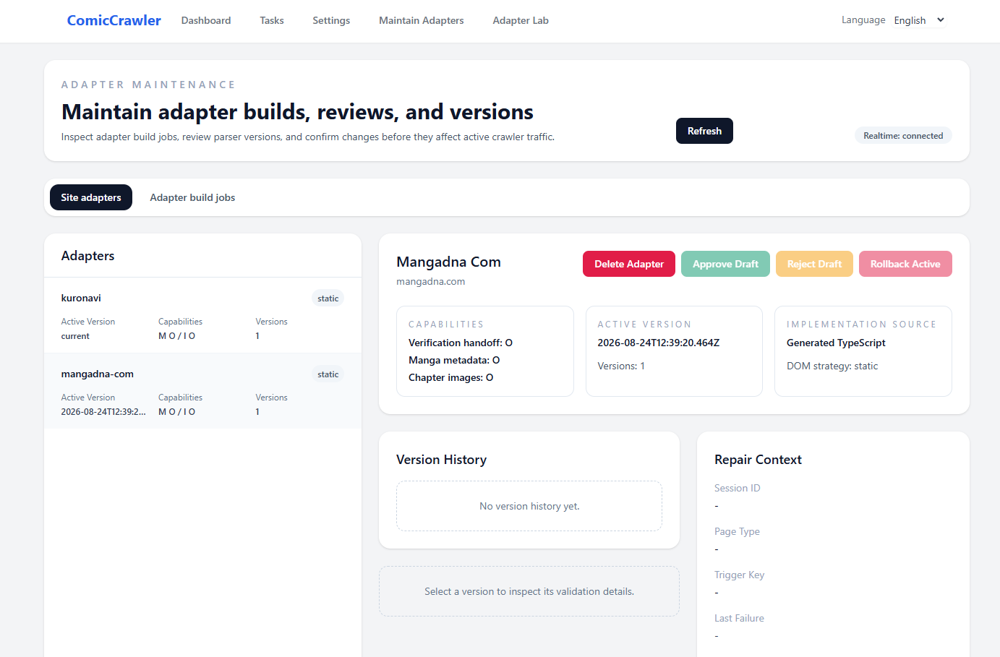
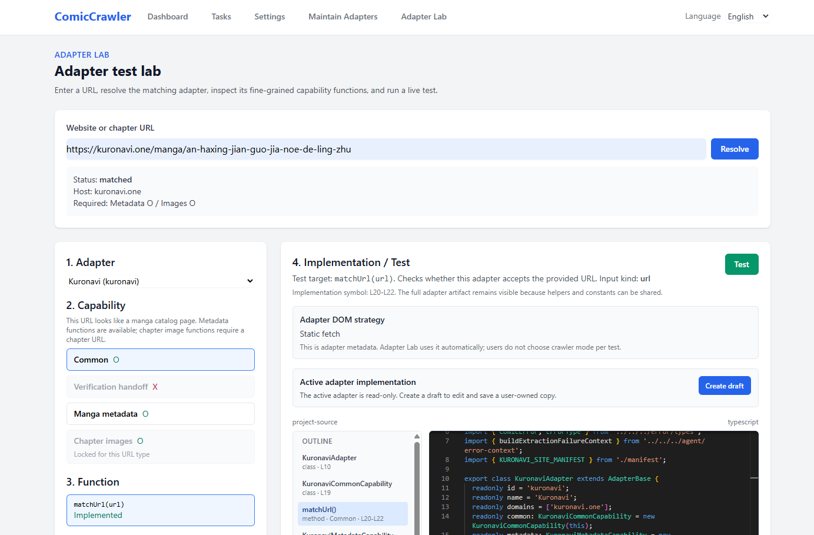

# ComicCrawler repo

## Development startup

Install dependencies from this directory:

```bash
npm install
```

Start backend, frontend, and the shared package watcher:

```bash
npm run dev
```

The dev launcher prefixes every service log line:

```text
[shared] ...
[backend] ...
[frontend] ...
[dev] backend ready: http://127.0.0.1:4100/api/status (200)
[dev] frontend ready: http://127.0.0.1:5173 (200)
```

Frontend startup is intentionally delayed until the backend health check passes.
This prevents the WebUI from opening while the `/api/*` proxy target is still
offline.

The default ports are convenience defaults, not hard requirements. On Windows,
Docker/WSL2/Hyper-V/VPN software can reserve port ranges dynamically. If the
default frontend port `5173` is unavailable, `npm run dev` automatically chooses
the next available frontend port and prints the actual URL. If you explicitly set
`COMICCRAWLER_FRONTEND_PORT` or `COMICCRAWLER_PORT`, that value is treated as a
hard requirement and startup fails with a clear message when the port cannot be
used.

If the WebUI shows HTTP 502, the frontend dev proxy cannot reach the backend.
Check the terminal for `[dev] backend not ready...` and the preceding `[backend]`
lines. The backend must be listening on the configured backend host/port before
`/api/*` requests from the WebUI can work.

To verify the dev launcher, run:

```bash
npm run test:dev
```

This is the required dev startup gate. It includes fake failure-path tests and a
real `npm run dev` smoke test that runs through `build:shared`, `dev:shared`,
`dev:backend`, and `dev:frontend`, waits for backend/frontend readiness, then
shuts down and verifies ports were released. For manual smoke testing, avoid
killing the shell with a timeout; use:

```bash
COMICCRAWLER_DEV_EXIT_AFTER_READY=1 npm run dev
```

On Windows PowerShell, if terminal encoding looks broken:

```bash
npm run dev:utf8
```

## Docker

From this repository root, build and start the production container with:

```bash
docker compose up --build -d
```

Docker maps container port `4100` to host port `4100`. The built frontend and
REST API are served by the same backend process:

- WebUI: `http://127.0.0.1:4100/`
- REST status: `http://127.0.0.1:4100/api/status`
- Swagger UI: `http://127.0.0.1:4100/api-docs`

Runtime data and downloads are persisted in the `comic-data` and
`comic-downloads` named volumes. Container logs rotate at 10 MB and retain up to
three files, limiting Docker JSON logs to approximately 30 MB per container. To
stop the container without deleting those volumes, run:

```bash
docker compose down
```

## GUI page guide

The WebUI navigation bar provides five main pages. Screenshots are tracked under
[`docs/images/pages/`](docs/images/pages/README.md) with fixed filenames, so the
images can be refreshed without changing these README links.

### Dashboard (`/`)

The dashboard is the main entry point for creating crawl tasks and checking
overall status. It shows task counts by status, lets users choose all-chapter or
specific-chapter crawling, previews the required URL shape, and lists registered
adapter capabilities. If no compatible adapter supports the entered URL, task
creation queues selector discovery instead of creating a crawl task.



### Task Manager (`/tasks`, `/tasks/:taskId`)

Task Manager combines the crawl task list with details for the selected task.
It shows forced task order, task status cards, crawl flow stages, progress,
metadata, chapter information, checkpoints, errors, and downloaded file
previews. Users can pause, resume, cancel, or delete tasks when their current
status permits it. When human verification is required, the task detail panel
opens an isolated browser and resumes from checkpoint afterward.



### Settings (`/settings`)

Settings manages interface language, download directory, concurrency, naming
template, image format, network timeouts, retry behavior, and browser rendering
options. It also manages Selector Discovery (AO) configuration: service URL,
provider document, selected model, connection tests, bundle release status, and
evaluation command guidance. General settings can be saved or reset to their
defaults.



### Maintain Adapters (`/agent`)

Maintain Adapters is the workspace for managing registered site adapters and
adapter build jobs. The **Site adapters** tab lists each adapter's domains,
capabilities, DOM strategy, active version label, version count, and
implementation source. Users can delete an adapter from this tab; generated
adapters are removed from runtime storage with a restorable deletion record, and
project TypeScript adapters delete their source directory under
`backend/src/adapter/sites/` as a code change after typed confirmation. The
**Deleted adapters** tab shows what can be restored and when git source recovery
is required.

The **Adapter build jobs** tab shows selector-discovery work for unknown sites
or missing capabilities. Review panels let users inspect generated TypeScript
drafts, run function tests, ask the Agent to revise one function, approve a
draft, or reject it.



### Adapter Lab (`/adapter-lab`)

Adapter Lab is a workspace for inspecting, editing, and testing adapter
implementations; it does not create crawl tasks. After resolving an entered URL,
the page identifies the matching adapter and URL type, locks unavailable
capabilities, and lets the user choose one implemented function as the test
target. It displays the full implementation with an outline, supports
user-owned drafts, and reports DOM source, readiness, timing, and extraction
summary. When human verification is required, the test result points users to
the handoff flow.



## Verification gates

Use these commands before handing off changes:

```bash
npm run verify:quick
```

`verify:quick` is the daily local gate. It runs the real dev startup smoke test,
builds shared/backend/frontend, checks UTF-8 encoding and common mojibake
patterns, runs the core backend tests for task reliability, crawler resume,
download behavior, and task routes, and runs the REST-only API crawl flow test.
GitHub Actions runs the same quick gate on every push and pull request.

```bash
npm run verify:local
```

`verify:local` is the full handoff gate. It runs `verify:quick` and then the full
Playwright E2E suite. The GitHub E2E workflow is currently manual
(`workflow_dispatch`) until the remote runner path is proven stable.

Rules of thumb:

- Changes to `npm run dev`, ports, Vite proxying, or process startup must pass `npm run test:dev`.
- Changes to public REST API contracts or crawl flow DTOs must pass `npm run test:api`.
- Changes to backend/frontend/shared code should pass at least `npm run verify:quick`.
- Changes to WebUI flows, crawler behavior, challenge handoff, selector discovery, or adapter promotion should pass `npm run verify:local`.
- Fake dev-launcher tests only cover failure branches. They must never be used as a substitute for the real `npm run dev` smoke test included in `npm run test:dev`.

## Runtime environment

Backend runtime settings can come from persisted ComicCrawler config or environment variables.
Environment variables override persisted config for process-level deployment settings.

| Setting | Environment variables | Default |
| --- | --- | --- |
| Backend host | `COMICCRAWLER_HOST`, `HOST` | `127.0.0.1` |
| Backend port | `COMICCRAWLER_PORT`, `PORT` | `4100` |
| Frontend dev port | `COMICCRAWLER_FRONTEND_PORT`, `FRONTEND_PORT` | `5173` |
| Frontend API proxy target | `COMICCRAWLER_API_TARGET` | `http://<backend-host>:<backend-port>` |
| Frontend WS proxy target | `COMICCRAWLER_WS_TARGET` | `ws://<backend-host>:<backend-port>` |
| Data path | `COMICCRAWLER_DATA_PATH`, `DATA_PATH` | dev: `./data`; packaged/production: OS app data directory |
| Agent workspace path | `AGENT_WORKSPACE_PATH` | `<data-path>/agent-workspaces` |
| Static frontend dir | `STATIC_DIR` | unset |

ComicCrawler resolves a single data root at bootstrap. Environment variables have
highest priority; otherwise development uses `repo/data/`, while packaged or
production runs use the OS application data directory such as
`%LOCALAPPDATA%/ComicCrawler` on Windows. New runtime areas are grouped under
`config/`, `user/`, `runtime/`, `agent-workspaces/`, and `logs/`; legacy flat
files in `data/` remain supported during migration.

Example:

```bash
COMICCRAWLER_PORT=4200 COMICCRAWLER_FRONTEND_PORT=5174 npm run dev
```

PowerShell:

```powershell
$env:COMICCRAWLER_PORT = "4200"
$env:COMICCRAWLER_FRONTEND_PORT = "5174"
npm run dev
```

## Browser challenge handoff

When a crawl reaches a human verification page, the task enters
`waiting_verification`. This is not a failed task; it releases the worker slot so
other queued tasks can continue.

The WebUI has one supported handoff path:

1. Open the affected task from Task Manager.
2. In the task detail panel, click **Open browser for verification**.
3. Complete the verification in the isolated browser profile opened by ComicCrawler.
4. Return to the same task detail page and click **Continue**.

ComicCrawler then resumes from the task checkpoint. If a verification handoff
expired or was removed, the task detail page asks you to click **Continue** to
recreate the handoff before opening the browser again.

The browser handoff always uses an isolated verification profile for v1. Your
normal Chrome/Brave profile is not selected or reused by the WebUI handoff.

Advanced/local CDP utilities still exist for tests and diagnostics, but they are
not the primary user flow.

## Documentation

- [User Guide](docs/USER_GUIDE.md) - WebUI crawl tasks, adapter discovery,
  adapter version maintenance, Adapter Lab editing/testing, verification
  handoff, resume, previews, and download folder behavior.
- [API Reference](docs/API.md) - REST automation contract and Swagger UI,
  available from a running backend at `GET /api-docs`.
- [Architecture](docs/ARCHITECTURE.md) - current subsystem overview and data
  flow.
- [Adapters](docs/ADAPTERS.md) - adapter capabilities, Adapter Lab, drafts, and
  verified DOM policy.
- [AO Selector Discovery](docs/AO_SELECTOR_DISCOVERY.md) - AO-assisted
  `AdapterBase` implementation draft flow and API lifecycle.
- [Contributing](CONTRIBUTING.md) - development workflow and verification rules.

## Why `npm run dev` builds shared first

The backend imports `@comiccrawler/shared` through the workspace package entrypoint.
On a fresh checkout, `shared/dist` may not exist yet. The root `dev` script builds
`shared` once and then starts a watch process so backend and frontend can resolve the
shared package reliably.
