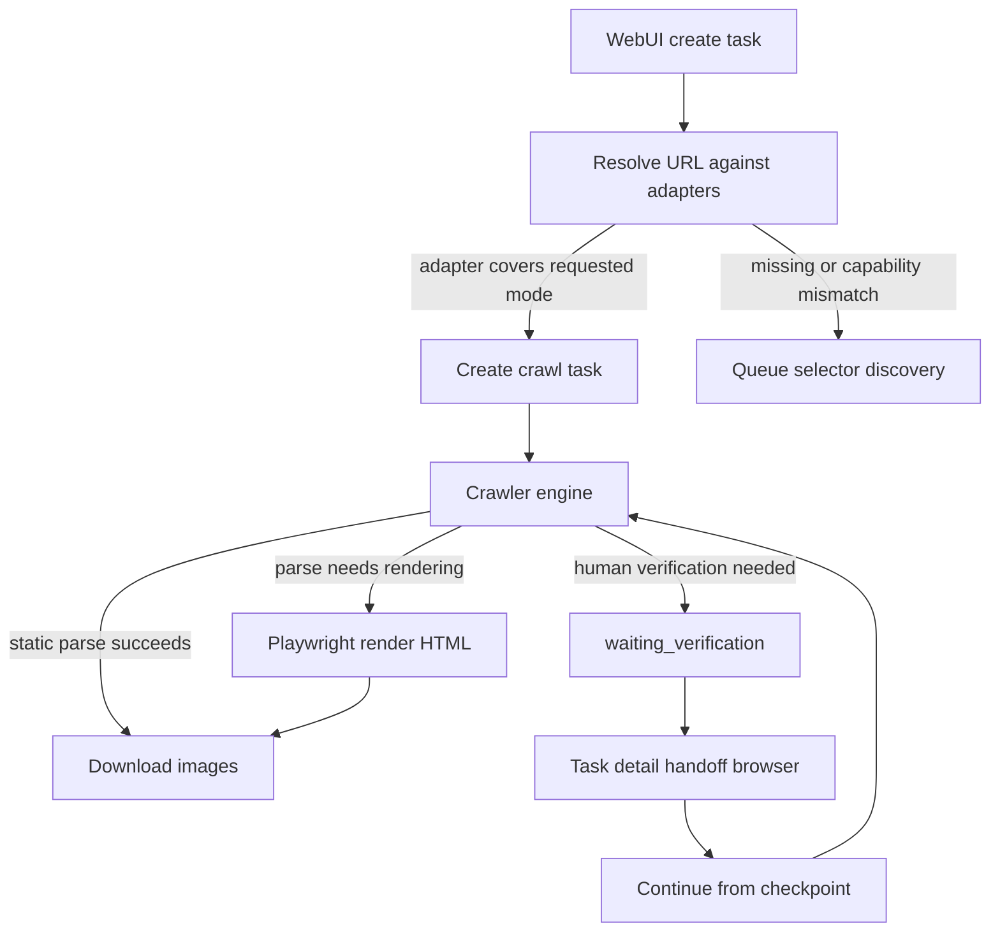

# ComicCrawler Architecture

ComicCrawler is a local-first monorepo application for adapter-based comic
crawling. The current runtime is built around a React WebUI, a Fastify backend,
shared TypeScript types/constants, Playwright-assisted rendering, and AO-assisted
selector discovery.

## Runtime layout

```text
repo/
  frontend/        React + Vite WebUI
  backend/         Fastify API, crawler engine, task queue, adapter runtime
  shared/          shared types and defaults
  agent/ao/        AO bundle drafts, skills, agents, contracts, eval cases
  docs/            user/contributor-facing docs
  data/            ignored runtime state
```

`repo/` is the source-of-truth Git root. Runtime data is ignored and not
committed. Development defaults to `repo/data/`; packaged or production runs use
the OS application data directory unless `COMICCRAWLER_DATA_PATH` overrides it.

The resolved data root is organized for new features as:

```text
<data-root>/
  config/           app and integration settings
  user/             user-owned drafts and preferences
  runtime/          task/challenge/checkpoint state
  agent-workspaces/ Agent/AO discovery, fixtures, eval artifacts
  logs/
```

Legacy flat files directly under `data/` remain supported during migration.

## Main flow



## Adapters and capabilities

Adapters identify supported domains and declare capabilities:

- `metadata` - extract manga metadata and chapter list from a parsed catalog document.
- `chapterImages` - extract image URLs from a parsed chapter document.
- `verification` - participate in verification handoff.

Runtime adapter code is split into an `AdapterBase` shell plus capability
handlers. The shell owns identity, domains, and fetch/render helpers; handlers
own the small extraction functions for `common`, `metadata`, `chapterImages`,
and `verification`. ComicCrawler runtime composes those functions into metadata
and image results internally. Agent-generated TypeScript should implement
capability handlers only, not runtime composer facade functions.

All-chapter tasks require metadata and chapter-image support. Specific-chapter
tasks require only chapter-image support. Built-in adapters have priority over
dynamic adapters. Dynamic adapters are promoted from reviewed selector discovery
drafts.

Selector discovery is intentionally modular:

- Chapter-only discovery is the base unit. It analyzes a chapter reader page and
  produces selectors for the `chapterImages.extractChapterImageUrls` capability.
- Full discovery adds metadata/catalog analysis before the same chapter image
  selector step. In other words, a full adapter is metadata/chapter-list
  discovery plus one or more chapter-only image extraction checks.

HappyMH is a representative full-adapter case that requires human verification
handoff before the crawler can see real manga DOM. Static probes of its catalog
pages can return a Chinese human-verification page; that HTML must be classified
as anti-bot content and must not be sent into selector discovery or promoted as
an adapter draft.

## Crawler rendering

The crawler supports static and Playwright-rendered HTML:

- Static mode fetches HTML and parses it with existing selector logic.
- Headless mode opens a Playwright page, waits for rendering, and passes
  `page.content()` into the same parser path.
- Auto mode prefers static HTML and falls back to headless rendering for parsing
  failures such as missing required selectors, no chapters, or no images.

Image downloading remains URL-based. Browser image fallback exists only for
specific verified-session cases.

## Task reliability

Tasks persist checkpoint state:

- current chapter
- extracted image list
- completed image indexes and paths
- failed image counts
- latest error and update time

Completed images are skipped on resume. `waiting_verification` releases the
worker slot, so unrelated queued tasks can continue while a user completes
verification.

Forced task order is stored separately from normal priority and is used by the
queue when deciding which pending task should run next.

## Human verification handoff

When a matched adapter encounters a human verification page, the task enters
`waiting_verification`. The supported WebUI path is:

1. Open the task detail page.
2. Click **Open browser for verification**.
3. Complete verification in the isolated browser profile.
4. Click **Continue** to resume from checkpoint.

If the challenge handoff expires or is removed, the task detail page prompts the
user to click **Continue** to recreate the handoff before opening the browser
again.

## Selector discovery and verification handoff

AO bundle sources live under `agent/ao/`.

- `selector-discovery` produces Markdown selector drafts for unknown or
  capability-missing sites.
- Human verification is handled in the current public flow through handoff jobs
  exposed under the historical `/api/challenge-discovery/*` namespace.
- Restricted challenge strategy drafts are experimental/internal work and
  are not the normal crawl path.

Agent-facing task and draft artifacts use Markdown section contracts rather
than JSON contracts. JSON remains limited to system settings such as
`opencode.json`, provider documents, API payloads, and internal manifests.

ComicCrawler treats its own workspace and `data/agent-workspaces` as the source
of truth. AO workspaces are short-lived execution surfaces, not persistent
project state.

## Configuration and defaults

Shared runtime defaults live in `shared/constants/index.ts`. Process-level
deployment settings can be overridden by environment variables documented in the
root README. The dev launcher waits for the backend before starting the
frontend, then verifies both services are ready.

## Documentation status

This document describes the current high-level architecture. Detailed API
schemas, adapter authoring guides, AO operation guides, and reliability internals
are tracked as follow-up documentation work in `docs/README.md`.
